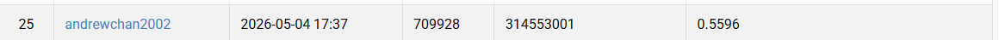

# NYCU Visual Recognition using Deep Learning — HW3

- **Student ID:** 314553001
- **Name:** 曾敬堯

---

## Introduction

This repository contains code for **Homework 3** of the NYCU Visual Recognition using Deep Learning course (Spring 2026). The task is **instance segmentation** of four types of medical cells (`class1`–`class4`) from TIF microscopy images, evaluated by **AP50** on CodaBench.

We build on **Mask R-CNN** (He et al., 2017) with a configurable ResNet backbone + FPN, adding:

- **Configurable backbone** — ResNet-50 (FPN V2), ResNet-101, or ResNet-152 via `--backbone`.
- **Advanced data augmentation** — H/V flip, random 90° rotation, photometric distortion, random affine, Gaussian noise, elastic deformation.
- **Improved RPN** — higher proposal counts and NMS threshold for dense cell images.
- **AdamW + OneCycleLR** — better convergence than SGD + CosineAnnealing.
- **Mixed-precision training (AMP)** — ~30% speedup with no quality loss.
- **Test-Time Augmentation (TTA)** — horizontal flip ensemble with per-class NMS.

**Best public AP50: 0.5596** (epoch 35 checkpoint, ResNet-152 backbone; validation AP50 = 0.5937).

---

## Environment Setup

**Requirements:** Python 3.9+, PyTorch 2.x, CUDA 11.8+

```bash
pip install torch torchvision torchaudio --index-url https://download.pytorch.org/whl/cu118
pip install -r requirements.txt
```

All other dependencies (tifffile, opencv-python, matplotlib, etc.) are listed in `requirements.txt`.

---

## Usage

### Training

```bash
# ResNet-152 run (best result) — saves best_model.pth when AP50 improves
python train.py --epochs 50 --batch-size 2 --lr 1e-3 --amp --eval-every 5 --backbone resnet152
```

| Flag | Description |
|---|---|
| `--epochs 50` | Train for 50 epochs (best AP50 peaks around epoch 30–38) |
| `--batch-size 2` | Increase to 4 if VRAM allows |
| `--lr 1e-3` | Head LR; backbone gets `lr * 0.1` |
| `--amp` | Mixed-precision training (requires CUDA) |
| `--eval-every 5` | Compute AP50 on val set every 5 epochs |
| `--backbone resnet152` | Backbone: `resnet50`, `resnet101`, or `resnet152` |
| `--accum-steps N` | Gradient accumulation for limited VRAM |
| `--resume path` | Resume from a checkpoint |

Checkpoints are saved to `checkpoints/`:
- `best_model.pth` — best by AP50 **(use this for submission)**
- `best_loss_model.pth` — best by validation loss
- `last_model.pth` — most recent epoch

Training automatically saves `training_curves.png` on completion.

### Local Evaluation

```bash
python evaluate.py --checkpoint checkpoints/best_model.pth --tta
```

### Inference (generate submission file)

```bash
python inference.py --checkpoint checkpoints/best_model.pth --score-thresh 0.5
```

Output: `test-results.json` → zip and upload to CodaBench.

---

## Performance Snapshot

| Model | Backbone | Val AP50 | Public AP50 |
|---|---|---|---|
| Mask R-CNN | ResNet-50 + FPN V2 | — | 0.4892 |
| Mask R-CNN | ResNet-101 + FPN | — | 0.5234 |
| **Mask R-CNN** | **ResNet-152 + FPN** | **0.5937** | **0.5596** |

Best checkpoint: **epoch 35**, public leaderboard AP50 = **0.5596**

> Screenshot: see `leaderboard_snapshot.png` in the repository.

---

## File Structure

```
HW3/
├── train.py           # Training loop + auto plot_training_curves() at end
├── dataset.py         # CellDataset + all augmentation transforms
├── model.py           # Mask R-CNN builder (--backbone resnet50/101/152)
├── inference.py       # TTA inference → test-results.json
├── evaluate.py        # Local COCO AP50 evaluation
├── requirements.txt
└── test_release/      # Test images (not submitted)
```

---

## GitHub

[https://github.com/andrewchan2002/NYCU-VR-HW3](https://github.com/andrewchan2002/NYCU-VR-HW3)

## Conda Bench Result
